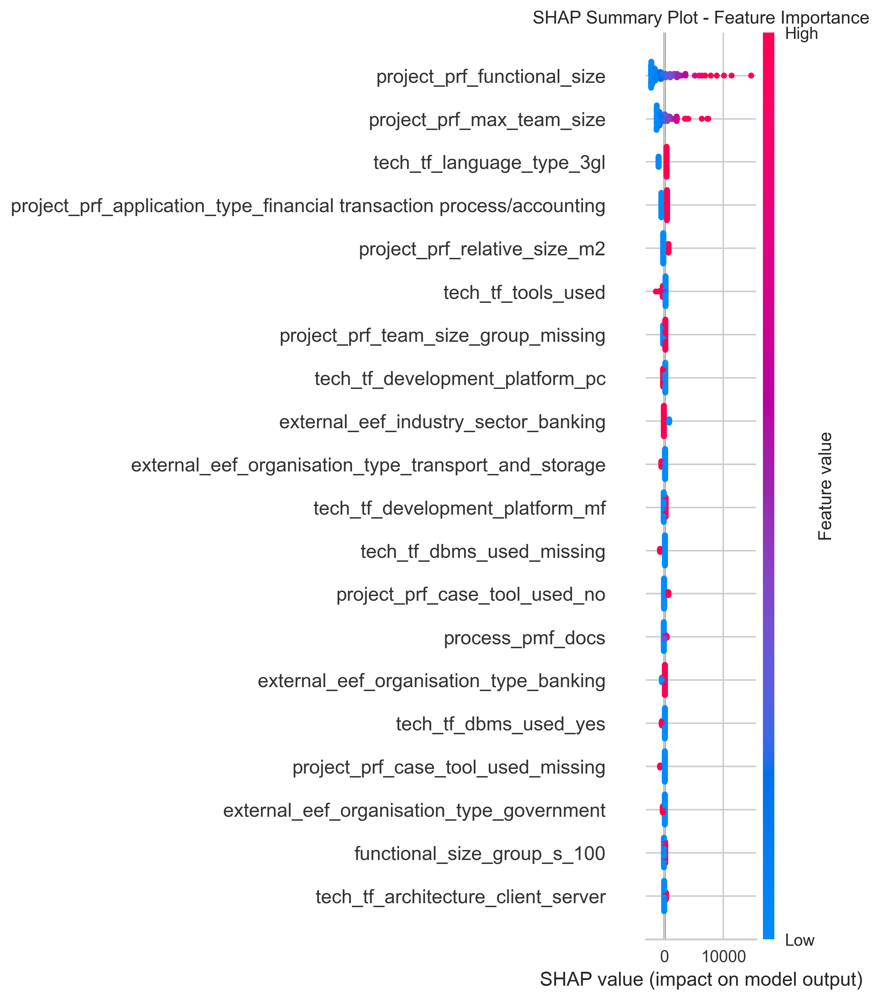

# SHAP Analysis Report — Feature Importance Explained

---

## Model 1: Bayesian Ridge Regression

### What this shows  
This summary plot ranks features by their overall impact on the model’s predictions. Each dot represents a data point colored by feature value (red = high, blue = low). The position along the x-axis shows the effect magnitude and direction of the feature on the prediction.

### Why these features matter  
- **`project_prf_functional_size`** is the top feature, meaning that projects with larger functional sizes strongly influence the predicted effort.  
- Technology-related features such as **`tech_tf_primary_programming_language`** and **`tech_tf_tools_used`** also significantly impact predictions, reflecting their influence on project complexity.

### Interpretation  
Higher values of important features tend to increase the predicted effort (indicated by red dots on the right). This helps explain why certain projects are estimated as more demanding.

---

## Model 2: Lasso Regression

### What this shows  
Lasso regression performs feature selection by driving some coefficients to zero, so the summary plot highlights a smaller subset of important features.

### Why these features matter  
- The model focuses on fewer features, reinforcing that **`project_prf_functional_size`** and a few tech variables dominate the prediction.  
- This sparsity improves interpretability without sacrificing performance.

### Interpretation  
The selected features are the primary drivers of predicted effort. Their SHAP values indicate how feature values push predictions higher or lower.

---

## Model 3: LassoLars Regression

### What this shows  
LassoLars also uses sparsity to identify relevant features, but with a different algorithmic approach. The summary plot reveals the main influential features.

### Why these features matter  
- **`project_prf_functional_size`** remains the most important feature.  
- Some variation in secondary features compared to Lasso is observed, reflecting subtle differences in model behavior.

### Interpretation  
This analysis helps users understand the main factors influencing predictions, increasing trust and transparency.

---

## Summary

- **SHAP values provide clear insights** into which features affect the model predictions and in what way.  
- **`project_prf_functional_size` is consistently the top driver** across models, confirming its critical role in effort estimation.  
- Technology and project characteristics also play significant roles.  
- This transparency helps users understand and trust the machine learning models.

---

## How to Use This Report

- Review feature importance plots to see which factors most influence effort predictions.  
- Use the explanations to communicate to stakeholders why certain projects are predicted to require more or less effort.  
- Combine this understanding with domain knowledge to make better project planning decisions.

---

*End of SHAP Analysis Report*
