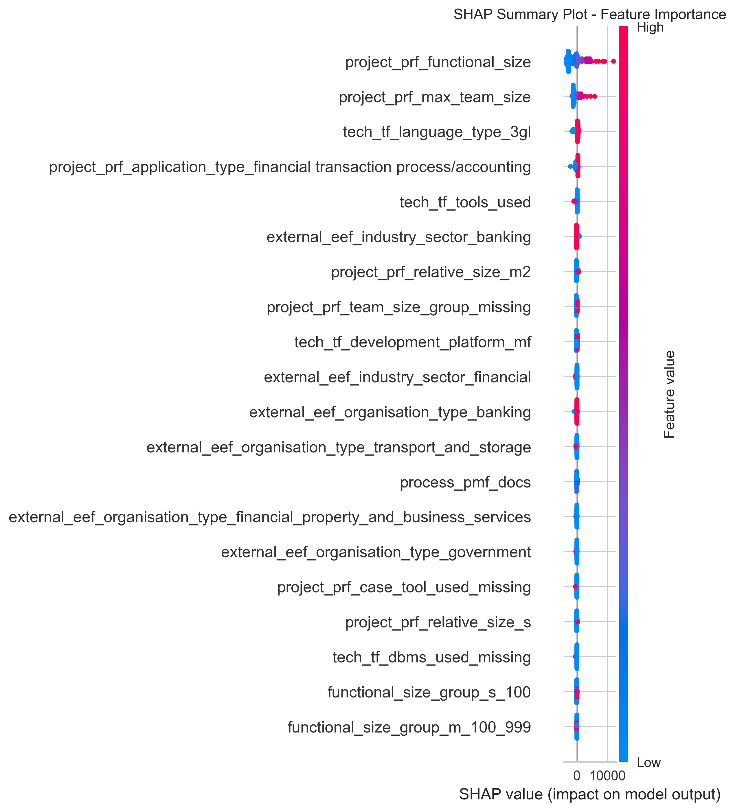
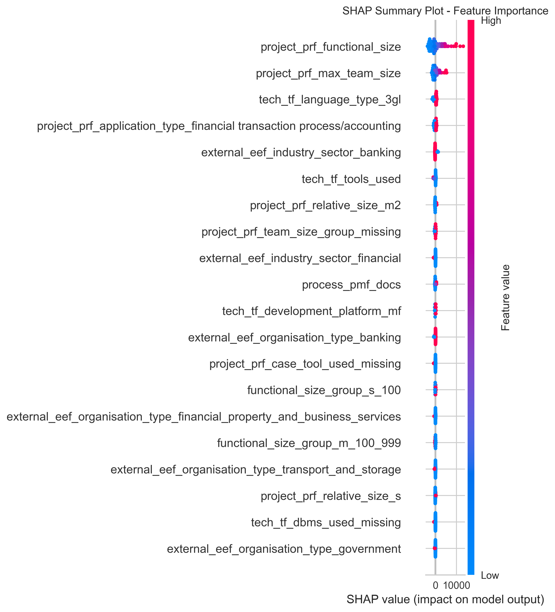

# SHAP Analysis Report — Feature Importance Explained

---

## Model 1: Gradient Boosting Regressor

### What this shows  
This SHAP summary plot visualizes which features most influence the predictions of the Gradient Boosting Regressor model. Each dot represents a project example, colored by feature value (red = high, blue = low). The x-axis position (SHAP value) indicates the magnitude and direction of the feature’s impact on predicted project effort.

### Why these features matter  
- **`project_prf_functional_size`** is the most important feature. High values (red) strongly increase effort estimation.  
- **Team and technology factors** like project_prf_max_team_size, tech_tf_language_type_3gl, project_prf_application_type_financial transaction process/accounting, and tech_tf_tools user are also highly impactful, showing that both people and technical stack contribute significantly to predictions.
- **Contextual features** such as external_eef_industry_sector_banking suggests that the type of industry or organization can shift the expected project effort.

### Interpretation  
Projects with higher values in key features—like larger functional size, bigger teams, and advanced technology types—tend to have higher predicted effort (red dots on the right). Conversely, lower values (blue) are linked with lower effort. This plot helps identify what project characteristics drive the Gradient Boosting model’s predictions, making the model’s reasoning more transparent for stakeholders.

---
## Model 2: Light Gradient Boosting Machine Regressor

### What this shows  
This SHAP summary plot ranks features by their overall importance in the LightGBM Regressor model’s predictions. Each dot represents a project instance, colored by feature value (red = high, blue = low). The x-axis (SHAP value) shows the impact and direction of the feature on the model’s output.

### Why these features matter  
- **`project_prf_functional_size`** has the highest impact, indicating that larger functional size strongly increases predicted effort.  
- Technology-related features such as **`tech_tf_language_type_3gl`** and team size features , **`project_prf_max_team_size`** are also influential, reflecting the role of technical complexity and staffing.

### Interpretation  
High values of important features (shown by red dots on the right) typically lead to higher predicted project effort, while low values (blue) are associated with lower effort predictions. This helps users understand the main drivers behind the LightGBM model’s estimates.

---

## Model 3: Bayesian Ridge Regressor

### What this shows  
This SHAP summary plot displays the most influential features in the predictions made by the Bayesian Ridge Regressor. Each point represents a project example, with color indicating the value of the feature (red = high, blue = low). The x-axis shows how much each feature pushes the prediction higher or lower (the SHAP value).

### Why these features matter  
- project_prf_functional_size remains the dominant driver, indicating that projects with greater functional size have much higher estimated effort.
- Team size and technical features such as project_prf_max_team_size and tech_tf_language_type_3gl continue to play strong roles, highlighting the importance of team structure and technology choices in predicting effort.
- Organizational and contextual variables like external_eef_industry_sector_banking shows that the business environment and sector can significantly affect the model’s output.

### Interpretation  
Larger functional size, bigger teams, and more advanced technology choices (high feature values, shown as red dots to the right) lead to higher predicted project effort. Conversely, projects with smaller scope, smaller teams, or simpler technologies (blue dots) are associated with lower effort estimates. This visualization clarifies which project characteristics are most influential in the Bayesian Ridge Regressor’s decision-making process.

---

## Summary

- **SHAP values provide clear insights** into which features affect the model predictions and in what way.  
- **`project_prf_functional_size` is consistently the top driver** across models, confirming its critical role in effort estimation.  
- Technology and project characteristics also play significant roles.  
- This transparency helps users understand and trust the machine learning models.

---

## How to Use This Report

- Review feature importance plots to see which factors most influence effort predictions.  
- Use the explanations to communicate to stakeholders why certain projects are predicted to require more or less effort.  
- Combine this understanding with domain knowledge to make better project planning decisions.

---

*End of SHAP Analysis Report*
